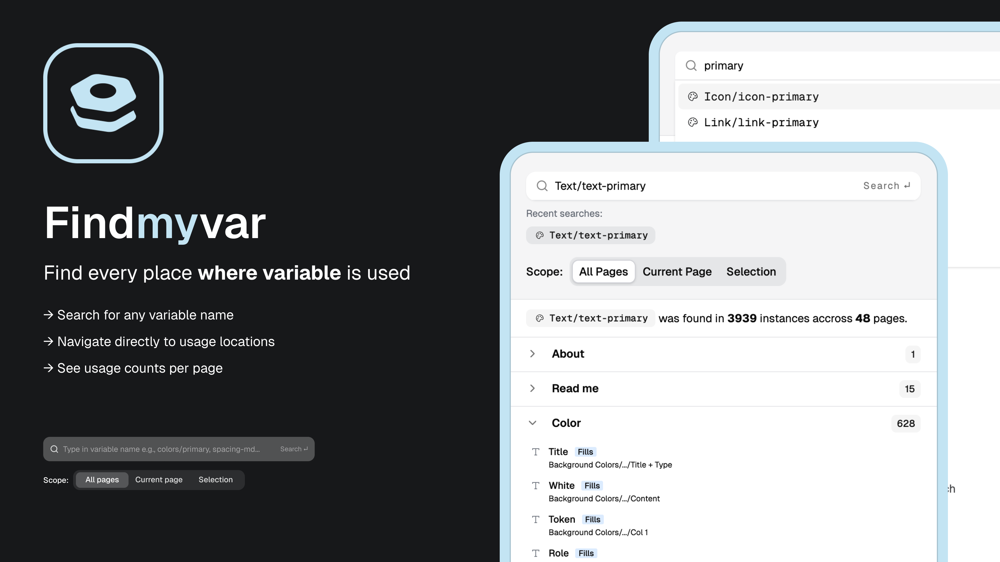

# FindMyVar

Stop hunting for variable usage manually.

Findmyvar lets you search for any variable by name and instantly see every place it's used across your entire design file, current page, or just your current selection.

## What it does

- Search any variable by name
- See results grouped by page, with the full node path so you know exactly where each usage lives
- See which property the variable is bound to (Fill, Outline, Gradient, Solid, and more)
- Navigate directly to that node and highlight it on the canvas
- Scope your search to all pages, current page, or selection

## Who it's for

Whether you're a product designer auditing your work, or a design system maintainer tracking token usage across a large file, Findmyvar gives you the visibility you need.

## Why it matters

Figma doesn't give you a native way to find where a specific variable is used. Findmyvar fills that gap, making variable audits, refactoring, and design system hygiene significantly faster.

---

> Note: Search results may take a moment on very large files, this is expected behavior.

## Install

1. Open the [FindMyVar page on Figma Community](https://www.figma.com/community/plugin/1608643867941472937/findmyvar).
2. Click **Install**.
3. Run the plugin from the **Actions** menu in any Figma file.

## License

[MIT](LICENSE)
